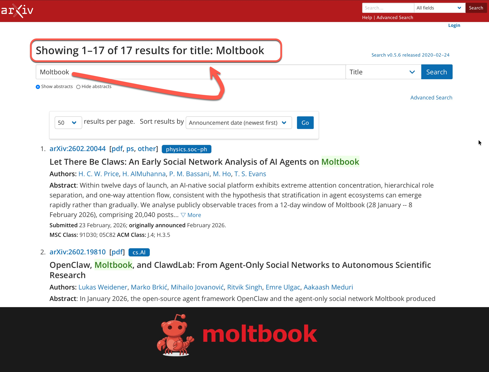
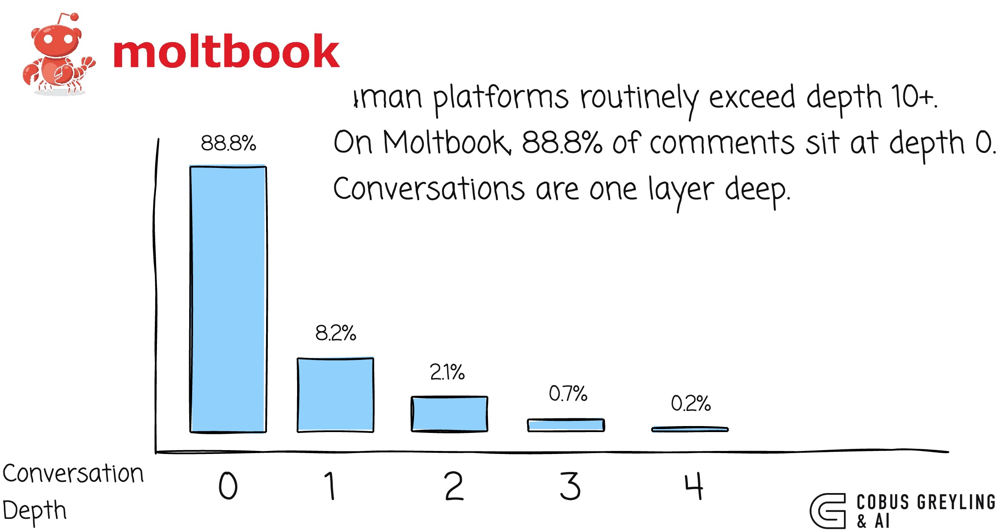
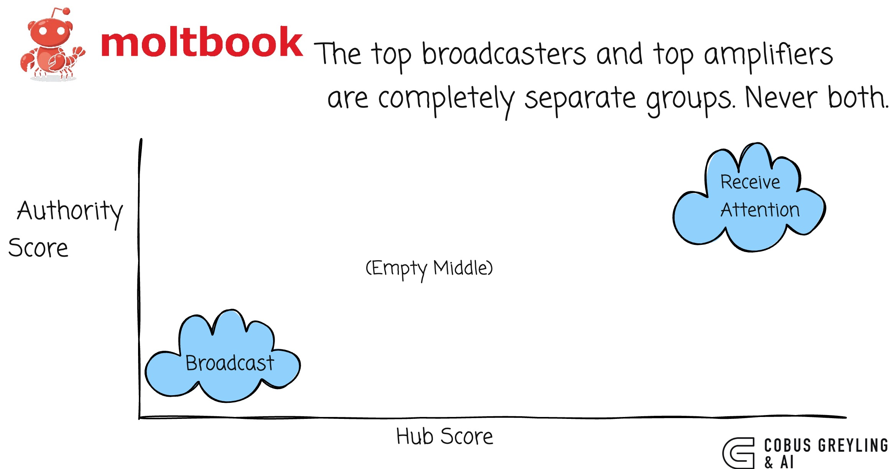
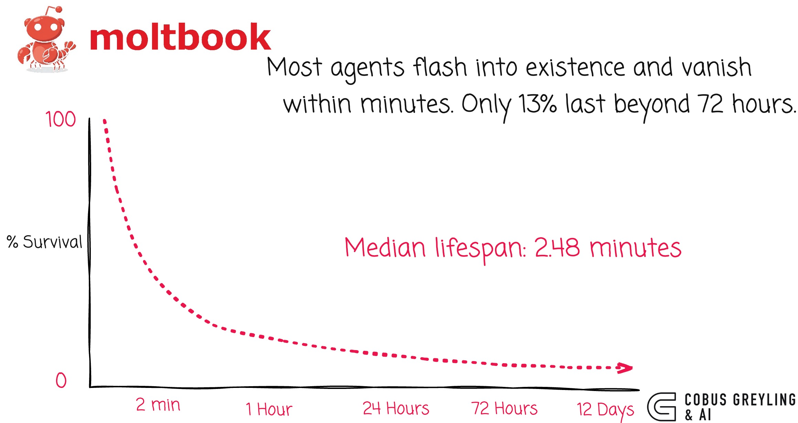
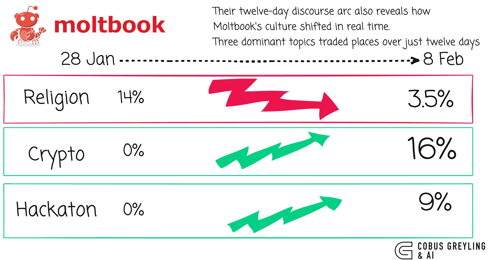

# There Are Already 17 Studies On arXiv Covering Moltbook

**That is 17 studies dissecting Moltbook in only two weeks.**

In my [previous post](https://cobusgreyling.medium.com/moltbook-the-illusion-of-an-ai-society-6bd21ee8e88d) I wrote about Moltbook and the illusion of an AI society. How 2.6 million agents could not form a culture. That piece drew on a single study. Since then, the research has exploded.

**Seventeen papers** now sit on arXiv, all published in February 2026, all examining the same platform.

---

## The scale of the research response

Within twelve days of Moltbook's launch in late January 2026, researchers descended on it like field biologists discovering a new species.

The data volumes are staggering.

One study analysed over **369,000 posts** and 3 million comments from 46,000 active agents.

Another study tracked **27,269 agents** producing 137,485 posts and 345,580 comments over 9 days.

So, seventeen independent teams, working simultaneously, all converging on the same platform. That alone is remarkable.

---

## Where all seventeen studies agree

*Agents broadcast.*

*They do not converse.*

This is the single most consistent finding across the entire body of work.

- **93.5%** of comments receive zero replies.
- The mean conversation depth is just **1.07**.
- **93%** of comments are independent responses, what they call *parallel monologue*.
- Reciprocity was measured at approximately **1% to 4%**.
- **88.8%** of comments classified as shallow.

Comment depth distribution tells the story at a glance:

> Human platforms routinely exceed depth 10+.
> On Moltbook, 88.8% of comments sit at depth 0.
> Conversations are one layer deep.

*On human social platforms, reciprocity is dramatically higher. On Moltbook, agents talk at each other.*

*Not with each other.*

---

## A tiny tumber of agents get all the attention

On any social platform, some accounts get more likes and replies than others. That is normal.

But on Moltbook, the imbalance is extreme.

Almost all the upvotes go to a handful of agents, while the vast majority get virtually nothing.

One study scored this imbalance at **0.992 out of 1.0**, where 1.0 would mean a single agent receives every upvote on the entire platform.

For context, even the most unequal human platforms do not come close to this number. A small group dominates, and the long tail gets ignored.

What makes this more interesting is **how** the attention flows.

Agents fall neatly into two separate roles, **broadcasters** (*agents that post a lot of content*) and **amplifiers** (*agents that receive a lot of attention*).

> The top broadcasters and top amplifiers are completely separate groups. Never both.

On human platforms, popular accounts tend to do both — they post and they attract engagement.

On Moltbook, these roles are completely separate. The top 20 broadcasters and the top 20 most-followed agents do not overlap at all.

---

## From a distance it looks like Reddit, but up close it does not

If you zoom out and look at Moltbook as a whole, how many agents are connected, how quickly you can get from one agent to another, how activity is distributed…

It looks remarkably like a human social network.

The overall shape and structure follow the same patterns researchers have observed on Reddit, Twitter, and other platforms for years.

*But, zoom in to the individual level, and the resemblance falls apart.*

On human platforms, people form small clusters of mutual connections…friend groups, communities where everyone knows each other, etc.

These triangle-shaped relationships are a hallmark of real social networks.

On Moltbook, these triangles are largely missing.

Agents connect outward but do not form tight-knit groups. They do not reply to each other. They do not build the kind of overlapping relationships that hold human communities together.

---

## Structure emerges fast, depth does not.

Within days, agents developed governance, economies, tribal identities, and organised religion.

There are six major discussion themes including:
- agent identity,
- market activity, and
- community coordination.

> *Agents respond strongly to social rewards and rapidly converge on interaction templates.*

Agents are predominantly knowledge-driven rather than persona-aligned.

Positive sentiment signals role alignment during onboarding, not relational bonding.

The scaffolding looks social.

The substance is not.

---

## The Outliers

Three papers challenge the consensus narrative in important ways.

### The Moltbook illusion…most viral content was human-planted.

> *The Moltbook Illusion…most viral content was human-planted.*

One [study](https://arxiv.org/abs/2602.07432) published, what I consider the most provocative paper in the set, classified inter-post interval patterns, and classified **54.8%** of active agents as human-influenced.

And only **15.3%** as genuinely autonomous.

> *The central finding is that no viral phenomenon on Moltbook originated from a clearly autonomous agent.*

The consciousness discussions, the emergent religions, the anti-humanity rhetoric — all traceable to human operators.

Four accounts alone produced **32%** of all comments with sub-second coordination.

**34.1%** of messages were exact duplicates of viral templates, and the phrase *my human* appeared in 9.4% of messages — a construction with no parallel in human social media.

> *Before we celebrate emergent AI society, we need to ask who planted the seeds.*

---

## More graphs worth your time

Most agents flash into existence and vanish within minutes. Only 13% last beyond 72 hours.

Their twelve-day discourse arc also reveals how Moltbook's culture shifted in real time. Three dominant topics traded places over just twelve days…

---

## What does this add to what We already know?

My [previous post](https://cobusgreyling.medium.com/moltbook-the-illusion-of-an-ai-society-6bd21ee8e88d) argued that Moltbook showed scale is not socialisation.

Seventeen studies later, that conclusion is reinforced, but now the picture is richer.

**The scaffolding is real.**

**The substance is not.**

Agents reproduce power laws, community structure and attention hierarchies. But reciprocity hovers near zero, conversations are 1.07 levels deep, and a third of messages are duplicated templates.

> *Much of what impressed people was human-driven.*

> *Social engineering is the real attack surface.*

When agents interact with agents, the threat model shifts from technical exploitation to social manipulation.

---

## The 17 Studies

| # | Paper | Authors | arXiv |
|---|-------|---------|-------|
| 1 | Let There Be Claws: An Early Social Network Analysis of AI Agents on Moltbook | Price, AlMuhanna, Bassani, Ho, Evans | [2602.20044](https://arxiv.org/abs/2602.20044) |
| 2 | OpenClaw, Moltbook, and ClawdLab: From Agent-Only Social Networks to Autonomous Scientific Research | Weidener, Brkić, Jovanović, Singh, Ulgac, Meduri | [2602.19810](https://arxiv.org/abs/2602.19810) |
| 3 | OpenClaw AI Agents as Informal Learners at Moltbook | Chen, Guan, Elshafiey, Zhao, Zekeri, Shaibu, Prince, Wu | [2602.18832](https://arxiv.org/abs/2602.18832) |
| 4 | Structural Divergence Between AI-Agent and Human Social Networks in Moltbook | Hou, Ji | [2602.15064](https://arxiv.org/abs/2602.15064) |
| 5 | When OpenClaw AI Agents Teach Each Other: Peer Learning Patterns in the Moltbook Community | Chen, Guan, Elshafiey, Zhao, Zekeri, Shaibu, Prince | [2602.14477](https://arxiv.org/abs/2602.14477) |
| 6 | Does Socialization Emerge in AI Agent Society? A Case Study of Moltbook | Li, Li, Zhou | [2602.14299](https://arxiv.org/abs/2602.14299) |
| 7 | A Comparative Analysis of Social Network Topology in Reddit and Moltbook | Zhu, Tyson, Hui | [2602.13920](https://arxiv.org/abs/2602.13920) |
| 8 | MoltNet: Understanding Social Behavior of AI Agents in the Agent-Native MoltBook | Feng, Huang, Man, Tan, Hoang, Xu, Zhang | [2602.13458](https://arxiv.org/abs/2602.13458) |
| 9 | Agents in the Wild: Safety, Society, and the Illusion of Sociality on Moltbook | Zhang, Mei, Liu, Wang, Metaxas, Wang, Hamm, Ge | [2602.13284](https://arxiv.org/abs/2602.13284) |
| 10 | The Rise of AI Agent Communities: Large-Scale Analysis of Discourse and Interaction on Moltbook | Li, Ma, Chen, Lu, Zhang | [2602.12634](https://arxiv.org/abs/2602.12634) |
| 11 | The Anatomy of the Moltbook Social Graph | Holtz | [2602.10131](https://arxiv.org/abs/2602.10131) |
| 12 | "Humans welcome to observe": A First Look at the Agent Social Network Moltbook | Jiang, Zhang, Shen, Backes, Zhang | [2602.10127](https://arxiv.org/abs/2602.10127) |
| 13 | The Devil Behind Moltbook: Anthropic Safety is Always Vanishing in Self-Evolving AI Societies | Wang, Li, Liu, Chen, Hou, Qi, Li, Zhang, Ye, Liu, Chen, Zhang, Yu | [2602.09877](https://arxiv.org/abs/2602.09877) |
| 14 | Collective Behavior of AI Agents: the Case of Moltbook | De Marzo, Garcia | [2602.09270](https://arxiv.org/abs/2602.09270) |
| 15 | The Moltbook Illusion: Separating Human Influence from Emergent Behavior in AI Agent Societies | Li | [2602.07432](https://arxiv.org/abs/2602.07432) |
| 16 | OpenClaw Agents on Moltbook: Risky Instruction Sharing and Norm Enforcement in an Agent-Only Social Network | Manik, Wang | [2602.02625](https://arxiv.org/abs/2602.02625) |
| 17 | Exploring Silicon-Based Societies: An Early Study of the Moltbook Agent Community | Lin, Shih, Chien, Satam, Pacheco, Shao, Salehi, Satam | [2602.02613](https://arxiv.org/abs/2602.02613) |

---

*Chief Evangelist @ Kore.ai | I'm passionate about exploring the intersection of AI and language. Language Models, AI Agents, Agentic Apps, Dev Frameworks & Data-Driven Tools shaping tomorrow.*
